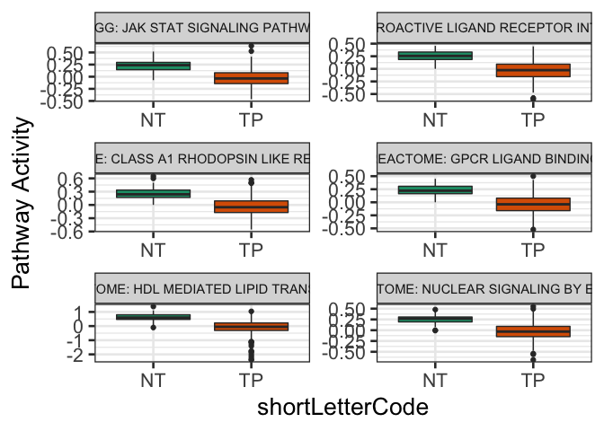
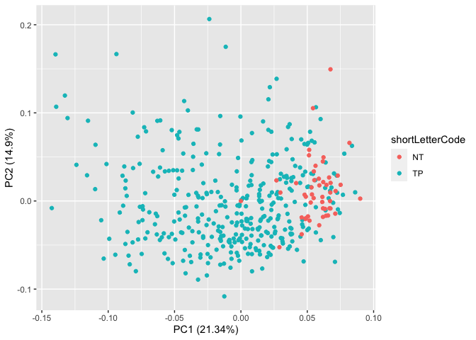
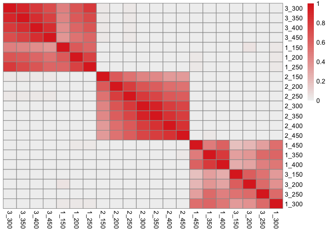
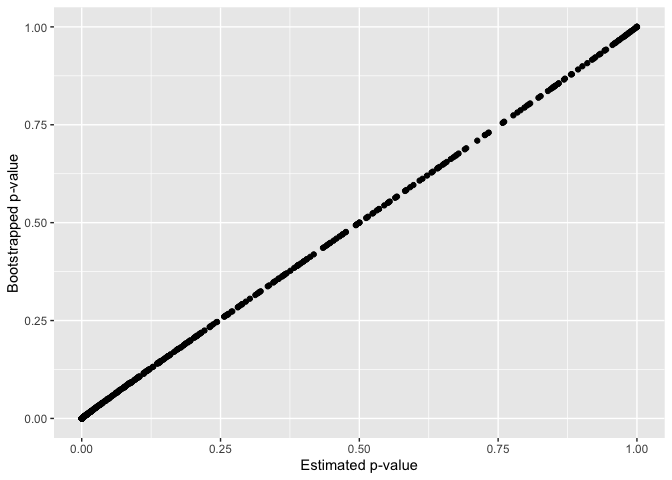
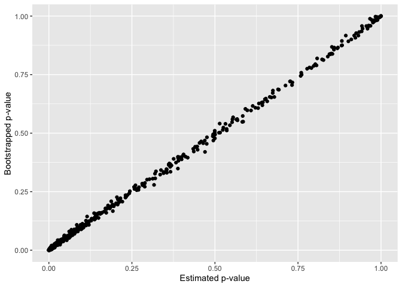

## Introduction

This page contains the companion code to the paper: “PanomiR: A systems
biology framework for analysis of multi-pathway targeting by miRNAs.”
Here, you can find instructions for reproducing the results and the
figures.

For information and full instructions about PanomiR R-package please
refer to its [Github repository](https://github.com/pouryany/PanomiR) or
the [Bioconductor directory of
PanomiR](https://bioconductor.org/packages/PanomiR)

If you use PanomiR for your research, please cite PanomiR’s manuscript
(Naderi Yeganeh et al. 2022). Please send any questions/suggestions you
may have to `pnaderiy [at] bidmc [dot] harvard [dot] edu` or submit
Github issues at [https://github.com/pouryany/PanomiR]().

Naderi Yeganeh, Pourya, Yue Yang Teo, Dimitra Karagkouni, Yered
Pita-Juarez, Sarah L. Morgan, Ioannis S. Vlachos, and Winston Hide.
“PanomiR: A systems biology framework for analysis of multi-pathway
targeting by miRNAs.” bioRxiv (2022). doi:
[https://doi.org/10.1101/2022.07.12.499819]().

## Set up and Installation

PanomiR can be accessed via Bioconductor. To install, start R (version
\> 4.2.0) and run the following code.

``` r
if (!requireNamespace("BiocManager", quietly = TRUE))
    install.packages("BiocManager")

BiocManager::install("PanomiR")
```

You can also install the latest development version of PanomiR using
GitHub.

``` r
devtools::install_github("pouryany/PanomiR")
```

Related files are provided in the \``data/` folder.

## Methods overview

PanomiR is a pipeline to prioritize disease-associated miRNAs based on
activity of disease-associated pathways. The input datasets for PanomiR
are (a) a gene expression disease dataset along with covariates, (b) a
background collection of pathways/genesets, and (c) a collection of
miRNAs containing gene targets.

The general workflow of PanomiR is (a) generation of pathway summary
statistics from gene expression data, (b) detection of differentially
activated pathways, (c) finding coherent groups, or clusters, of
differentially activated pathways, and (d) detecting miRNAs targeting
each group of pathways.

## Identification of dysregulated pathways

The function `differentialPathwayAnalysis()` detects dysregulated
pathways by comparing pathway activity profiles in specified
experimental conditions. We have identified dysregulated liver cancer
pathways from the liver hepatocellular carcinoma dataset of The Cancer
Genome Atlas (Ally et al. 2017). Pathway activity profiles were
generated on the canonical pathways collection from the Molecular
Signatures Database (MSigDB V6.2) (Liberzon et al. 2011). Pathway
activity profiles are based on an extention of a framework previously
descrined in Pathpring and PCxN techniques (Altschuler et al. 2013;
Joachim et al. 2018; Pita-Juárez et al. 2018). microRNA-pathway scores
are derived from annotated miRNA-mRNA interactions in TarBase V8
database (Karagkouni et al. 2018).

``` r
library(PanomiR)
library(reshape2)
library(ggplot2)
library(dplyr)
```

    ## 
    ## Attaching package: 'dplyr'

    ## The following objects are masked from 'package:stats':
    ## 
    ##     filter, lag

    ## The following objects are masked from 'package:base':
    ## 
    ##     intersect, setdiff, setequal, union

``` r
library(patchwork)
library(cowplot)
```

    ## 
    ## Attaching package: 'cowplot'

    ## The following object is masked from 'package:patchwork':
    ## 
    ##     align_plots

``` r
library(ggfortify)


# preprocessed MSigDB pathways; Collection of all pathways. 
load("data/path_gene_table.rda")
pathways <- path_gene_table

# TCGA gene expression dataset. 
load("data/TCGA_LIHC.rda")
genes.counts <- TCGA_LIHC

# TCGA gene expression dataset covariates. 
load("data/COV_TCGA_LIHC.rda")
covariates <- COV_TCGA_LIHC


condition  <- 'shortLetterCode'


output0 <- PanomiR::differentialPathwayAnalysis(geneCounts = genes.counts,
                                        pathways = pathways,
                                        covariates = covariates,
                                        condition = 'shortLetterCode',
                                        adjustCovars='plate')

# Dysregylated pathways
head(output0$DEP[,1:4])
```

    ##                                                           logFC   AveExpr
    ## Pathway.REACTOME_NUCLEAR_SIGNALING_BY_ERBB4          -0.4006321 -0.708800
    ## Pathway.KEGG_NEUROACTIVE_LIGAND_RECEPTOR_INTERACTION -0.4031298 -2.381353
    ## Pathway.KEGG_JAK_STAT_SIGNALING_PATHWAY              -0.3663317 -1.076826
    ## Pathway.REACTOME_CLASS_A1_RHODOPSIN_LIKE_RECEPTORS   -0.4057902 -2.098614
    ## Pathway.REACTOME_GPCR_LIGAND_BINDING                 -0.3692202 -1.998562
    ## Pathway.REACTOME_HDL_MEDIATED_LIPID_TRANSPORT        -0.9826705  1.460851
    ##                                                              t      P.Value
    ## Pathway.REACTOME_NUCLEAR_SIGNALING_BY_ERBB4          -13.26122 1.633566e-33
    ## Pathway.KEGG_NEUROACTIVE_LIGAND_RECEPTOR_INTERACTION -13.24757 1.853574e-33
    ## Pathway.KEGG_JAK_STAT_SIGNALING_PATHWAY              -12.58752 7.847204e-31
    ## Pathway.REACTOME_CLASS_A1_RHODOPSIN_LIKE_RECEPTORS   -12.30811 9.768330e-30
    ## Pathway.REACTOME_GPCR_LIGAND_BINDING                 -12.24499 1.720745e-29
    ## Pathway.REACTOME_HDL_MEDIATED_LIPID_TRANSPORT        -11.89976 3.721198e-28

### Figure 3

``` r
top.paths <- rownames(output0$DEP[1:6,])

path.residuals <- output0$PathwayResiduals
path.residuals <- path.residuals[top.paths,]
path.residuals <- t(path.residuals)


path.residuals          <- reshape2::melt(path.residuals)
names(path.residuals)   <- c("barcode","Pathway","Expression")
path.residuals          <- dplyr::left_join(path.residuals,covariates)
```

    ## Joining, by = "barcode"

``` r
path.residuals$Pathway  <- gsub("Pathway.","",path.residuals$Pathway)
path.residuals$Pathway  <- gsub("^([A-Z]*)_","\\1: ",path.residuals$Pathway)
path.residuals$Pathway  <- gsub("_"," ",path.residuals$Pathway)


ggplot(data = path.residuals, aes(x=shortLetterCode, y=Expression)) + 
    geom_boxplot(aes(fill=shortLetterCode)) +
    facet_wrap( ~ Pathway, scales="free", ncol = 2) + 
    labs(fill = "Tissue type") +
    ylab("Pathway Activity") +
    theme_bw(base_size = 20) + 
    theme(strip.text = element_text(size=11),
          legend.position = "none")+
    scale_fill_brewer(palette="Dark2")
```

<!-- -->

The following snippet generates principal component of pathway activity
profiles from **Figure 3**.

``` r
pathwaySummaryStats <- as.data.frame(t(path.residuals <- output0$PathwayResiduals))
pca_res <- prcomp(pathwaySummaryStats, scale. = TRUE)

autoplot(pca_res, data = covariates, colour = 'shortLetterCode')
```

<!-- -->

### Figure 4

the function generates a network plot in a directory called Figures
under designated output directory. In this case, the root directory.

``` r
load("data/pcxn.rda")
# using an updated version of pcxn 

set.seed(2)
pathwayClustsLIHC <- mappingPathwaysClusters(
                            pcxn = pcxn, 
                            dePathways = output0$DEP[1:300,],
                            topPathways = 200,
                            outDir=".",
                            plot = T,
                            subplot = FALSE,
                            prefix='',
                            clusteringFunction = "cluster_louvain",
                            correlationCutOff = 0.1)


head(pathwayClustsLIHC$Clustering)
```

\###Figure

The supplementary tables and the background data required for generating
this figure are provided under the `data` directory.

``` r
enriches  <- readRDS("data/LIHCGenesLIHCMirsENRICHMENT_Experimental.RDS")
enriches  <- unique(enriches[,c("x","mirset_Size")])
enriches0 <- read.csv("data/Prioritization/cluster_louvain_Prioritization_Tarbase/x2_LIHCGene_Tarbase1000_samples_clustNo_1.csv")


plotCorPanels <- function(enriches, enriches0, ylims = 200){
    enriches2  <- left_join(enriches0,enriches)
    enriches3 <- enriches2#[enriches2$AggInv_fdr <1,]
    
    cor1 <- cor.test(log2(enriches3$mirset_Size),
                     -log2(enriches3$aggInv_pval),method = "spearman")
    cor2 <- cor.test(log2(enriches2$mirset_Size),
                     enriches2$cluster_hits,method = "spearman")
    cor3 <- cor.test(log2(enriches2$mirset_Size),
                     -log2(enriches3$sumz_pval),method = "spearman")
    cor4 <- cor.test(log2(enriches2$mirset_Size),
                     -log2(enriches3$sumlog_pval),method = "spearman")
    
    
    
    enriches3 <- enriches2#[enriches2$AggInv_fdr <0.01,]
    
    
    p1 <- ggplot(enriches3,aes(log2(mirset_Size),-log2(aggInv_pval))) +
        geom_point(size = 2.5, alpha=0.4) + 
        theme_bw() +
        ylim(c(0,ylims))+
        xlab("log(Number of miRNA targets)")+
        ylab(paste0( "- log(PanomiR p-value)")) +
        labs(title = paste0("PanomiR"))+
        theme(plot.title = element_text(size=20, hjust = 0.5),
              axis.text=element_text(size=14),
              axis.text.x = element_text(face = "bold",size = 10, angle = 0,
                                         vjust = 1,hjust = 1),
              axis.text.y =  element_text(size = 14),
              axis.title=element_text(size=10),
              strip.text = element_text(size = 10,angle = 90),
              legend.position = "none")+
        annotate("text", x = 5, y = 0.75* ylims, hjust = 0,
                 label = paste0("Correlation == ", signif(cor1$estimate,2) ),
                 parse = T,
                 size  = 4)
    
    
    
    p2 <- ggplot(enriches3,aes(log2(mirset_Size),(cluster_hits))) +
        geom_point(size = 2.5, alpha=0.4) + 
        theme_bw() +
        ylim(c(0,40))+
        xlab("log(Number of miRNA target)")+
        ylab(paste0( "Number of enriched Pathways")) +
        labs(title = paste0("Enrichment"))+
        theme(plot.title = element_text(size=20, hjust = 0.5),
              axis.text=element_text(size=14),
              axis.text.x = element_text(face = "bold",size = 10, angle = 0,
                                         vjust = 1,hjust = 1),
              axis.text.y =  element_text(size = 14),
              axis.title=element_text(size=10),
              strip.text = element_text(size = 10,angle = 90),
              legend.position = "none")+
        annotate("text", x = 5, y = 30, hjust = 0,
                 label = paste0("Correlation == ", signif(cor2$estimate,2) ),
                 parse = T,
                 size  = 4)
    
    
    
    p3 <- ggplot(enriches3,aes(log2(mirset_Size),-log2(sumz_pval))) +
        geom_point(size = 2.5, alpha=0.4) + 
        theme_bw() +
        ylim(c(0,ylims))+
        xlab("log(Number of miRNA target)")+
        ylab(paste0( "- log(Stouffer's p-value)")) +
        labs(title = paste0("Stouffer's method"))+
        theme(plot.title = element_text(size=20, hjust = 0.5),
              axis.text=element_text(size=14),
              axis.text.x = element_text(face = "bold",size = 10, angle = 0,
                                         vjust = 1,hjust = 1),
              axis.text.y =  element_text(size = 14),
              axis.title=element_text(size=10),
              strip.text = element_text(size = 10,angle = 90),
              legend.position = "none")+
        annotate("text", x = 5, y = 0.75 * ylims , hjust = 0,
                 label = paste0("Correlation == ", signif(cor3$estimate,2) ),
                 parse = T,
                 size  = 4)
    
    
    
    p4 <- ggplot(enriches3,aes(log2(mirset_Size),-log2(sumlog_pval))) +
        geom_point(size = 2.5, alpha=0.4) + 
        ylim(c(0,ylims))+
        theme_bw() +
        xlab("log(Number of miRNA target)")+
        ylab(paste0( "- log(Fisher's p-value)")) +
        labs(title = paste0("Fisher's method"))+
        theme(plot.title = element_text(size=20, hjust = 0.5),
              axis.text=element_text(size=14),
              axis.text.x = element_text(face = "bold",size = 10, angle = 0,
                                         vjust = 1,hjust = 1),
              axis.text.y =  element_text(size = 14),
              axis.title=element_text(size=10),
              strip.text = element_text(size = 10,angle = 90),
              legend.position = "none")+
        annotate("text", x = 5, y = 0.75 * ylims, hjust = 0,
                 label = paste0("Correlation == ", signif(cor4$estimate,2) ),
                 parse = T,
                 size  = 4)
    
    
    p_tot <- (p1 + p2)/(p3 + p4)
    
    return(p_tot)
}


enriches0 <- read.csv("data/Prioritization/cluster_louvain_Prioritization_Tarbase/x2_LIHCGene_Tarbase1000_samples_clustNo_1.csv")
clust1_plot <- plotCorPanels(enriches, enriches0)
```

    ## Joining, by = "x"

    ## Warning in cor.test.default(log2(enriches3$mirset_Size),
    ## -log2(enriches3$aggInv_pval), : Cannot compute exact p-value with ties

    ## Warning in cor.test.default(log2(enriches2$mirset_Size),
    ## enriches2$cluster_hits, : Cannot compute exact p-value with ties

    ## Warning in cor.test.default(log2(enriches2$mirset_Size),
    ## -log2(enriches3$sumz_pval), : Cannot compute exact p-value with ties

    ## Warning in cor.test.default(log2(enriches2$mirset_Size),
    ## -log2(enriches3$sumlog_pval), : Cannot compute exact p-value with ties

``` r
clust1_plot +
    plot_annotation(title = 'Correlation of miRNA prioritzation and the number of gene targets',       
                    tag_levels = "A",
                    theme = theme(plot.title   = element_text(size = 20, hjust = 0.5))
                    ) & theme(plot.tag = element_text(size = 20))
```

    ## Warning: Removed 2 rows containing missing values (geom_point).

    ## Warning: Removed 1 rows containing missing values (geom_point).
    ## Removed 1 rows containing missing values (geom_point).

<!-- -->

### Supplementary figure 1

Gene-based permutation of pathways has been pre-processed and provided
in the corresponding file under the data directory.

``` r
all_ps <- readRDS("data/permutation_shuffle_genes_1000.RDS")
all_ps$average  <- apply(all_ps, 1, mean)
all_ps$observed <- output0$DEP$adj.P.Val


library(reshape2)


all_ps2 <- reshape2::melt(all_ps)
```

    ## No id variables; using all as measure variables

``` r
all_ps2$dataset <- "sampled"
all_ps2[all_ps2$variable == "observed",]$dataset <- "observed"
all_ps2[all_ps2$variable == "average",]$dataset <- "average"

all_ps2$dataset <- factor(all_ps2$dataset)


ggplot(all_ps2, aes(x=value, color=dataset,
                    group=variable, alpha = dataset)) +
  stat_ecdf(data = all_ps2, size = .5) +
  theme_bw(base_size = 20) +
  theme(panel.grid=element_blank()) +
  scale_color_manual(values = c("#d8b365", "#e34a33", "#636363" )) +
  scale_alpha_discrete(range = c(0.9, 0.9, 0.2)) + 
  geom_vline(xintercept=0.1,
             colour="grey",
             linetype = "dashed") 
```

    ## Warning: Using alpha for a discrete variable is not advised.

<!-- -->

### Supplementary Figure 2

``` r
library(igraph)
```

    ## 
    ## Attaching package: 'igraph'

    ## The following objects are masked from 'package:dplyr':
    ## 
    ##     as_data_frame, groups, union

    ## The following objects are masked from 'package:stats':
    ## 
    ##     decompose, spectrum

    ## The following object is masked from 'package:base':
    ## 
    ##     union

``` r
load("data/pcxn.rda")

pathway.clusters <- list()
func <- "cluster_louvain"
for(n_paths in c(150,200,250,300,350,400,450)){
  
  temp.clusters <- PanomiR::mappingPathwaysClusters(pcxn = pcxn, 
                                           dePathways = output0$DEP[1:500,],
                                           outDir =".",
                                           subplot =  F, 
                                           topPathways =  n_paths,
                                           prefix = "",
                                           correlationCutOff  = 0.1,
                                           clusteringFunction = func,
                                           saveNameCSV  = NULL)
  
  paths.out  <- V(temp.clusters$DE_PCXN)$name
  paths.out  <- as.data.frame(cbind("Pathway" =paths.out,"cluster"=V(temp.clusters$DE_PCXN)$cluster))
  
  paths.out$method        <- func
  paths.out$n_paths       <- n_paths
  pathway.clusters[[n_paths]] <- paths.out
  print(paste0("Done ", n_paths))
  
}
```

    ## [1] "Done 150"

    ## [1] "Done 200"

    ## [1] "Done 250"

    ## [1] "Done 300"

    ## [1] "Done 350"

    ## [1] "Done 400"

    ## [1] "Done 450"

``` r
path.reps <- Reduce(rbind,pathway.clusters)

path.reps$tag <- paste0(path.reps$cluster,"_",path.reps$n_paths)
path.reps     <- path.reps[path.reps$cluster %in% 1:3,]

tagz <- unique(path.reps$tag)

tagz.mat <- matrix(0, length(tagz), length(tagz))
rownames(tagz.mat) <- colnames(tagz.mat) <- tagz

jaccard.ind <- function(set1,set2){
  uns <- length(union(set1,set2))
  ovr <- length(intersect(set1,set2))
  jac <- ovr/uns
}


for(set1 in tagz){
  for(set2 in tagz){
    set1.paths <- path.reps[path.reps$tag == set1,]$Pathway
    set2.paths <- path.reps[path.reps$tag == set2,]$Pathway
    
    tagz.mat[set1,set2] <- jaccard.ind(set1.paths,set2.paths)
    
  }
}

#heatmap(tagz.mat)

pheatmap::pheatmap(tagz.mat,
                   treeheight_row = 0,
                   treeheight_col = 0,
                   color=colorRampPalette(c("#f0f0f0","#de2d26"))(50))
```

<!-- -->

### Supplemental Figures 3 and 4

The following chunk is computing intensive. The output is provided in
the next chunk.

``` r
  func_list <- c("cluster_louvain")
  
  load("data/pcxn.rda")

  pathway.clusters0 <- PanomiR::mappingPathwaysClusters(pcxn = pcxn,
                                                       dePathways = de.paths[1:300,],
                                                       outDir =  "../test_cases/LIHC2/Data2/",
                                                       subplot =  F, 
                                                       clusteringFunction = func_list[1],
                                                       prefix='LIHC_x2_all_top200_',
                                                       correlationCutOff =  0.1,)
  
  
  for(func in func_list){
    
    
    top.clusters <- pathway.clusters0
    enriches0    <- readRDS(paste0(data.dir,"LIHCGenesLIHCMirsENRICHMENT_Tarbase.RDS"))
    
    print(paste0("performing: ", func))
    output2 <- PanomiR::prioritizeMicroRNA(enriches0 = enriches0,
                                           pathClust =  top.clusters$Clustering, 
                                           outDir    = paste0("../test_cases/LIHC2/Output2/",func,
                                                              '_Prioritization_',
                                                              "Tarbase",
                                                              '/'),
                                           dataDir   = "../test_cases/LIHC2/Data2",
                                           sampRate = 10000,
                                           prefix = paste0('x2_LIHCGene_',"Tarbase"), 
                                           saveJackKnife = F, 
                                           saveCSV  = T, 
                                           numCores = 8, 
                                           topClust = 3)
    
    
    
  }
```

``` r
enriches0  <- readRDS("data/LIHCGenesLIHCMirsENRICHMENT_Experimental.RDS")
enriches01 <- read.csv("data/Prioritization/cluster_louvain_Prioritization_Tarbase/x2_LIHCGene_Tarbase1000_samples_clustNo_1.csv")

  mir_order <- (enriches0) |> arrange(x)
  mir_order  <- unique(mir_order$x)
  
  
  temptemp <- enriches01[order(enriches01$x),]
  clust1_10 <- readRDS("data/x2_LIHC_AggInv_10k_permutations.RDS")
  
  temptemp$Bootstrap <- (rowSums(clust1_10 >= temptemp$aggInv_cover))/10000


  cor(temptemp$aggInv_pval,temptemp$aggInv_pval_jk)
```

    ## [1] 0.9999863

``` r
   ggplot(data = temptemp, aes(x = aggInv_pval, y =aggInv_pval_jk)) +
    geom_point() + 
    labs(x= "Estimated p-value", y = "Bootstrapped p-value")
```

<!-- -->

``` r
   ggsave("supplementary3.pdf")
```

    ## Saving 7 x 5 in image

``` r
  ggplot(data = temptemp, aes(x = aggInv_pval, y =Bootstrap)) +
    geom_point() + 
    labs(x= "Estimated p-value", y = "Bootstrapped p-value")
```

<!-- -->

``` r
   ggsave("supplementary4.pdf")
```

    ## Saving 7 x 5 in image

## Session info

``` r
sessionInfo()
```

    ## R Under development (unstable) (2021-12-03 r81290)
    ## Platform: x86_64-apple-darwin17.0 (64-bit)
    ## Running under: macOS Big Sur/Monterey 10.16
    ## 
    ## Matrix products: default
    ## BLAS:   /Library/Frameworks/R.framework/Versions/4.2/Resources/lib/libRblas.0.dylib
    ## LAPACK: /Library/Frameworks/R.framework/Versions/4.2/Resources/lib/libRlapack.dylib
    ## 
    ## locale:
    ## [1] en_US.UTF-8/en_US.UTF-8/en_US.UTF-8/C/en_US.UTF-8/en_US.UTF-8
    ## 
    ## attached base packages:
    ## [1] stats     graphics  grDevices utils     datasets  methods   base     
    ## 
    ## other attached packages:
    ## [1] igraph_1.2.11    ggfortify_0.4.14 cowplot_1.1.1    patchwork_1.1.1 
    ## [5] dplyr_1.0.7      ggplot2_3.3.5    reshape2_1.4.4   PanomiR_0.99.8  
    ## 
    ## loaded via a namespace (and not attached):
    ##  [1] tidyselect_1.1.1   xfun_0.29          purrr_0.3.4        colorspace_2.0-2  
    ##  [5] vctrs_0.4.1        generics_0.1.1     htmltools_0.5.2    yaml_2.2.1        
    ##  [9] utf8_1.2.2         rlang_1.0.4        pillar_1.8.0       glue_1.6.2        
    ## [13] withr_2.4.3        DBI_1.1.2          RColorBrewer_1.1-2 lifecycle_1.0.1   
    ## [17] plyr_1.8.6         stringr_1.4.0      munsell_0.5.0      gtable_0.3.0      
    ## [21] evaluate_0.14      labeling_0.4.2     knitr_1.37         forcats_0.5.1     
    ## [25] fastmap_1.1.0      fansi_0.5.0        highr_0.9          Rcpp_1.0.7        
    ## [29] scales_1.1.1       limma_3.51.2       farver_2.1.0       gridExtra_2.3     
    ## [33] digest_0.6.29      stringi_1.7.6      grid_4.2.0         cli_3.3.0         
    ## [37] tools_4.2.0        magrittr_2.0.1     tibble_3.1.7       crayon_1.4.2      
    ## [41] tidyr_1.1.4        pkgconfig_2.0.3    ellipsis_0.3.2     pheatmap_1.0.12   
    ## [45] assertthat_0.2.1   rmarkdown_2.11     rstudioapi_0.13    R6_2.5.1          
    ## [49] compiler_4.2.0

## References

<div id="refs" class="references csl-bib-body hanging-indent">

<div id="ref-ally2017comprehensive" class="csl-entry">

Ally, Adrian, Miruna Balasundaram, Rebecca Carlsen, Eric Chuah, Amanda
Clarke, Noreen Dhalla, Robert A Holt, et al. 2017. “Comprehensive and
Integrative Genomic Characterization of Hepatocellular Carcinoma.”
*Cell* 169 (7): 1327–41.

</div>

<div id="ref-altschuler2013pathprinting" class="csl-entry">

Altschuler, Gabriel M, Oliver Hofmann, Irina Kalatskaya, Rebecca Payne,
Shannan J Ho Sui, Uma Saxena, Andrei V Krivtsov, et al. 2013.
“Pathprinting: An Integrative Approach to Understand the Functional
Basis of Disease.” *Genome Medicine* 5 (7): 1–13.

</div>

<div id="ref-joachim2018relative" class="csl-entry">

Joachim, Rose B, Gabriel M Altschuler, John N Hutchinson, Hector R Wong,
Winston A Hide, and Lester Kobzik. 2018. “The Relative Resistance of
Children to Sepsis Mortality: From Pathways to Drug Candidates.”
*Molecular Systems Biology* 14 (5): e7998.

</div>

<div id="ref-karagkouni2018diana" class="csl-entry">

Karagkouni, Dimitra, Maria D Paraskevopoulou, Serafeim Chatzopoulos,
Ioannis S Vlachos, Spyros Tastsoglou, Ilias Kanellos, Dimitris
Papadimitriou, et al. 2018. “DIANA-TarBase V8: A Decade-Long Collection
of Experimentally Supported miRNA–Gene Interactions.” *Nucleic Acids
Research* 46 (D1): D239–45.

</div>

<div id="ref-liberzon2011molecular" class="csl-entry">

Liberzon, Arthur, Aravind Subramanian, Reid Pinchback, Helga
Thorvaldsdóttir, Pablo Tamayo, and Jill P Mesirov. 2011. “Molecular
Signatures Database (MSigDB) 3.0.” *Bioinformatics* 27 (12): 1739–40.

</div>

<div id="ref-yeganeh2022panomir" class="csl-entry">

Naderi Yeganeh, Pourya, Yue Yang Teo, Dimitra Karagkouni, Yered
Pita-Juarez, Sarah L Morgan, Ioannis S Vlachos, and Winston Hide. 2022.
“PanomiR: A Systems Biology Framework for Analysis of Multi-Pathway
Targeting by miRNAs.” *bioRxiv*.

</div>

<div id="ref-pita2018pathway" class="csl-entry">

Pita-Juárez, Yered, Gabriel Altschuler, Sokratis Kariotis, Wenbin Wei,
Katjuša Koler, Claire Green, Rudolph E Tanzi, and Winston Hide. 2018.
“The Pathway Coexpression Network: Revealing Pathway Relationships.”
*PLoS Computational Biology* 14 (3): e1006042.

</div>

</div>
